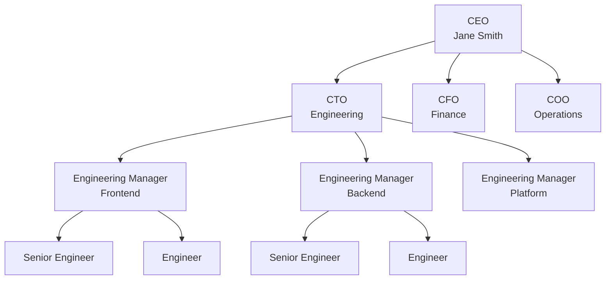
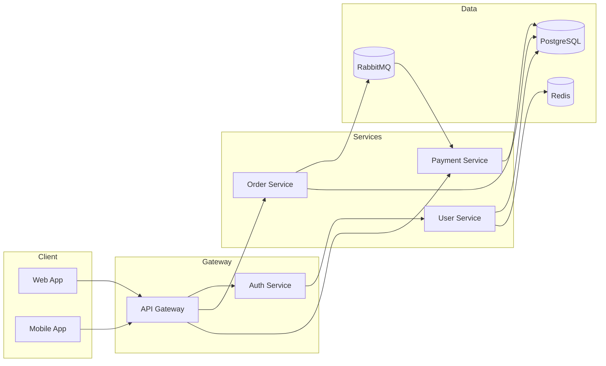
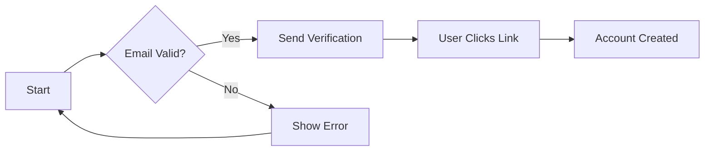
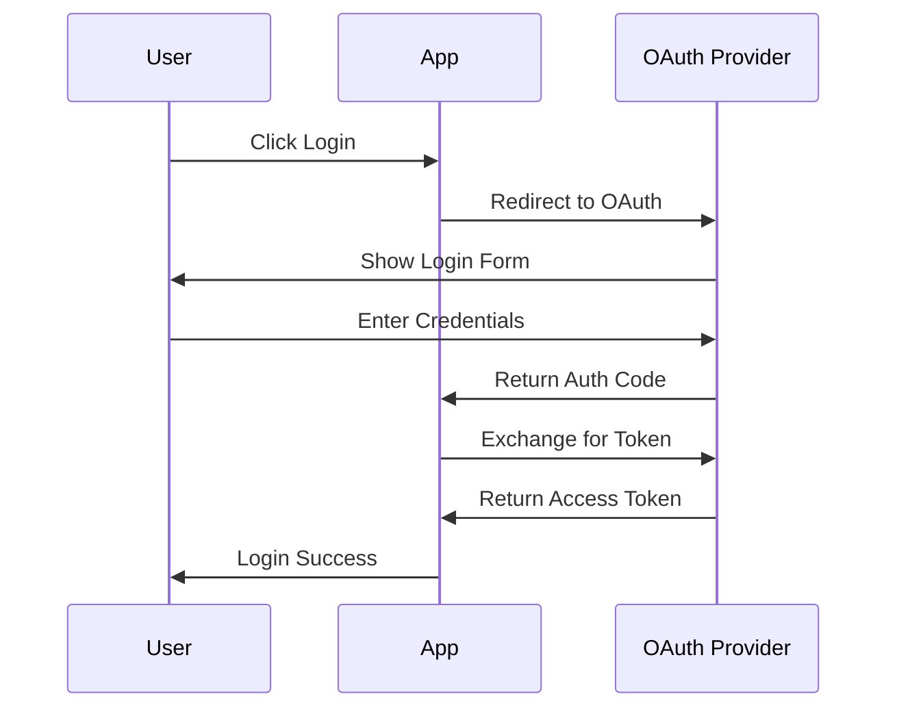
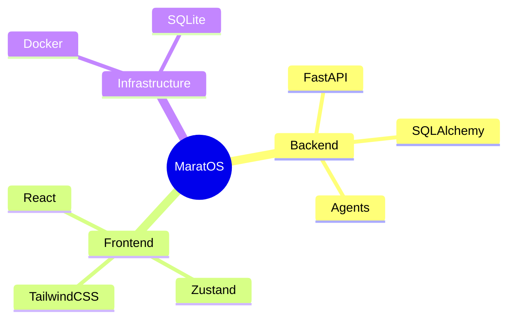
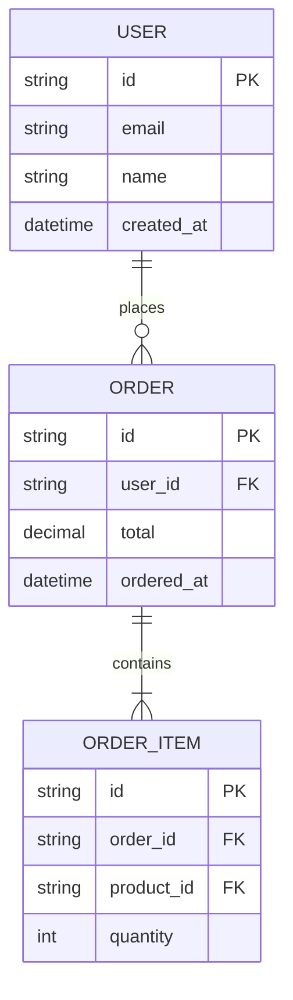
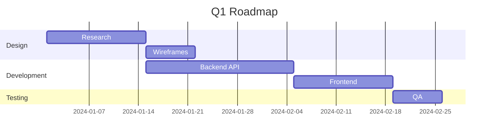
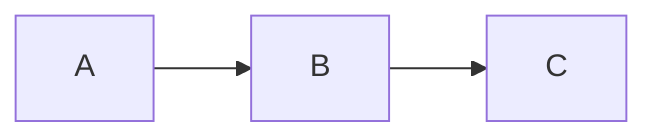
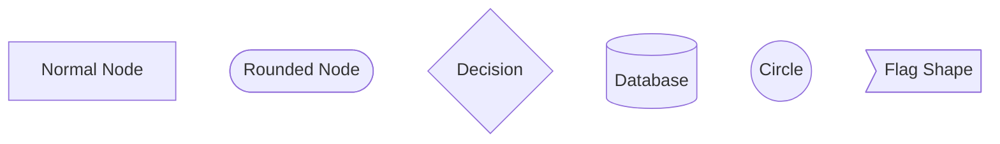

# Diagram Rendering Guide

This document describes how to render diagrams in MaratOS chat, including org charts, flowcharts, and other visual representations.

## Overview

MaratOS uses **Mermaid.js** for diagram rendering. When you ask the AI for a diagram, it should output a Mermaid code block that will be automatically rendered as an interactive SVG.

## Supported Diagram Types

| Type | Use Case | Example Start |
|------|----------|---------------|
| `flowchart` | Flowcharts, org charts, process flows | `flowchart TB` or `flowchart LR` |
| `graph` | Same as flowchart (legacy) | `graph TD` |
| `sequenceDiagram` | API calls, message flows | `sequenceDiagram` |
| `classDiagram` | UML class diagrams | `classDiagram` |
| `stateDiagram` | State machines | `stateDiagram-v2` |
| `erDiagram` | Database schemas | `erDiagram` |
| `gantt` | Project timelines | `gantt` |
| `pie` | Pie charts | `pie` |
| `journey` | User journeys | `journey` |
| `mindmap` | Mind maps, idea structures | `mindmap` |
| `timeline` | Chronological events | `timeline` |
| `gitGraph` | Git branch visualization | `gitGraph` |
| `quadrantChart` | 2x2 matrices | `quadrantChart` |
| `sankey` | Flow/allocation diagrams | `sankey-beta` |
| `xychart` | XY charts | `xychart-beta` |
| `C4Context` | C4 architecture context | `C4Context` |

## How to Request Diagrams

### Org Charts

Ask for an org chart and the AI will generate a flowchart:

```
Show me the org structure with CEO at top, VP of Engineering and VP of Sales below
```

Expected output:


**Tips for org charts:**
- Use `TB` (top-to-bottom) direction for hierarchical structures
- Use `<br/>` for multi-line labels
- Group related nodes visually

### Service Architecture

For microservice or system architecture diagrams:

```
Show me the service architecture for our backend
```

Expected output:


**Tips for architecture diagrams:**
- Use `LR` (left-to-right) for data flow
- Use `subgraph` to group related components
- Use `[(name)]` for database shapes

### Flowcharts

Request a process flow:

```
Create a flowchart for the user signup process
```

Expected output:


### Sequence Diagrams

For API or interaction flows:

```
Show the sequence for OAuth login
```

Expected output:


### Mind Maps

For brainstorming or hierarchical concepts:

```
Create a mind map of the project architecture
```

Expected output:


### Entity-Relationship Diagrams

For database schemas:

```
Show the database schema for users and orders
```

Expected output:


### Gantt Charts

For project timelines:

```
Create a Gantt chart for the Q1 roadmap
```

Expected output:


## Direction Modifiers

For flowcharts, you can control direction:

- `TB` or `TD` - Top to Bottom (default for org charts)
- `BT` - Bottom to Top
- `LR` - Left to Right (default for process flows)
- `RL` - Right to Left

Example:


## Styling

Mermaid supports some styling within diagrams:



## Security Notes

- **SVG Sanitization**: All rendered diagrams are sanitized to remove potential XSS vectors
- **Strict Mode**: Mermaid runs in strict security mode, disabling click handlers
- **No External Resources**: Diagrams cannot load external images or scripts

## Troubleshooting

### Diagram Not Rendering

1. Check that the code block has the `mermaid` language tag:
   ````
   ```mermaid
   flowchart TB
       A --> B
   ```
   ````

2. Ensure syntax is correct (no missing arrows, brackets match)

3. Check browser console for specific Mermaid errors

### Common Syntax Errors

- **Missing direction**: `flowchart` needs `TB`, `LR`, etc.
- **Invalid characters**: Node IDs cannot start with numbers
- **Unmatched quotes**: Labels with quotes must be properly escaped
- **Arrow syntax**: Use `-->` not `->` for arrows

## Agent Guidelines

When generating diagrams, agents should:

1. **Always use Mermaid code fences** - Not ASCII art or other formats
2. **Choose appropriate diagram type** - Org charts use `flowchart TB`, sequences use `sequenceDiagram`
3. **Keep diagrams focused** - Split large diagrams into multiple smaller ones
4. **Add meaningful labels** - Use descriptive node names
5. **Test syntax** - Ensure diagram renders before sending

### Diagram Type Selection

| User Request | Diagram Type |
|--------------|--------------|
| "org chart", "organization structure", "team hierarchy" | `flowchart TB` |
| "process flow", "workflow", "decision tree" | `flowchart LR` |
| "API flow", "call sequence", "interaction" | `sequenceDiagram` |
| "database schema", "data model", "entity relationship" | `erDiagram` |
| "class diagram", "object model", "UML" | `classDiagram` |
| "state machine", "state flow", "lifecycle" | `stateDiagram-v2` |
| "timeline", "project schedule", "roadmap" | `gantt` |
| "brainstorm", "mind map", "concept map" | `mindmap` |
| "user journey", "experience flow" | `journey` |
| "architecture", "system design", "service map" | `flowchart LR` with subgraphs |

### HTML Content Rules

When agents output HTML content (not diagrams), they must:

1. **Use only allowed tags**: `p`, `strong`, `em`, `ul`, `ol`, `li`, `table`, `thead`, `tbody`, `tr`, `th`, `td`, `code`, `pre`, `a`, `div`, `span`, `h1`-`h6`
2. **Never output**: `<script>`, `<style>`, `<iframe>`, event handlers (`onclick`, etc.)
3. **Prefer Markdown**: Use Markdown syntax when possible (it's natively supported)

## Reference

- [Mermaid Official Documentation](https://mermaid.js.org/)
- [Mermaid Live Editor](https://mermaid.live/) - Test diagrams online
